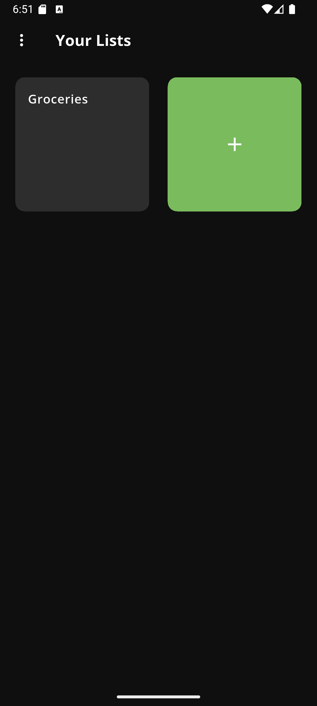
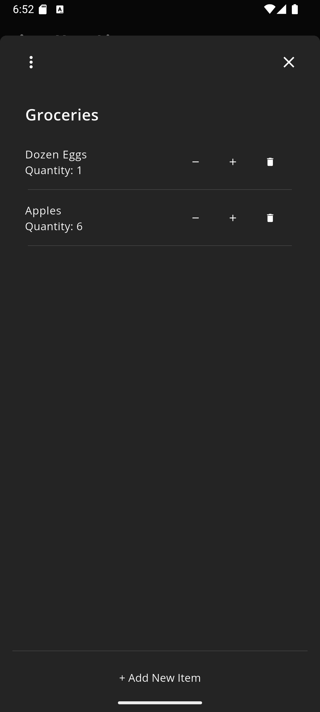

# InPantry - Inventory Management App

InPantry is a cross-platform mobile app built with Flutter for managing personal inventory. Users can create lists, add items and quantities, which are stored locally or in the cloud with Firebase.

## Features

* Create, edit, and delete inventory lists.
* Add or remove items, change quantities.
* User authentication with **Firebase Authentication**.
* Save data locally with **SharedPreferences** when signed out.
* Sync data to **Firebase Realtime Database** when signed in.
* Light and dark mode with theme settings persistence.
* Modern user interface inspired by productivity apps.

## Screenshots

  
  
  

## How It's Made

**Tech stack:** Flutter, Firebase Authentication, Firebase Realtime Database, SharedPreferences

This stack was chosen because Flutter allowed for a cross-platform app with a single codebase. SharedPreferences was used for data persistence for users that are not signed in. Firebase allowed for sign in with cloud save functionality.

## Challenges & Lessons Learned

* Ensuring consistent local and cloud data storage
* Designing user interface to be consistent throughout the app
* Balanced scheduling and time constraints as a group of five
* Using Scrum framework helped provide structure, but came with challenges in completing deliverable items for each sprint
* Software engineering is not simply about coding - but it also requires teamwork, learning, and adaptability
* Agile principles and Scrum framework help stay organized and adapt to changes depending on stakeholders needs

## Future Improvements

* Barcode scanning for adding items
* Shared lists within groups of users
* Ability to add images to items
* Expiration date tracking
* Implement AI with suggestions

## Note

This project was a conceptual exercise in software engineering and is not optimized for production use. It reflects on my ability to apply software engineering principles while collaborating with a team to design and build a functional app.